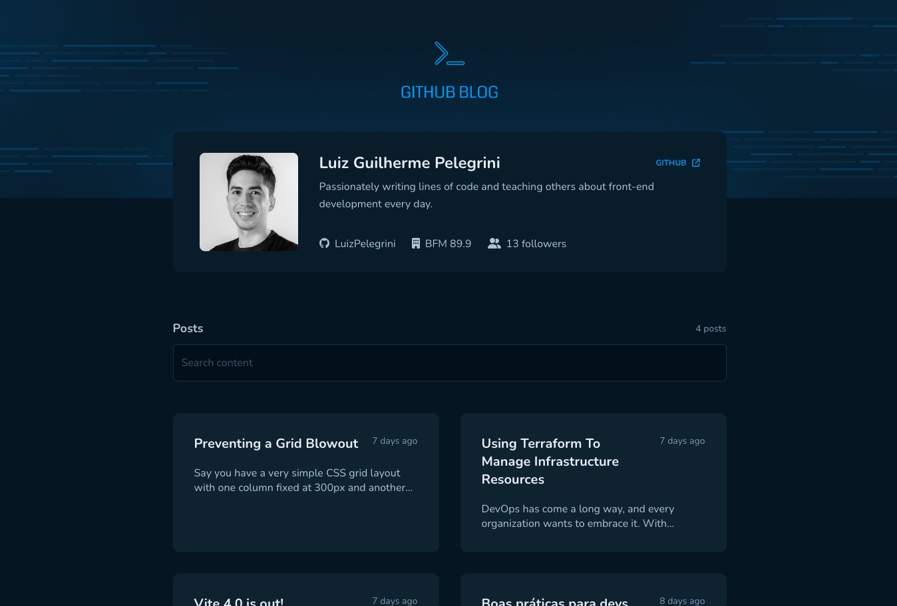
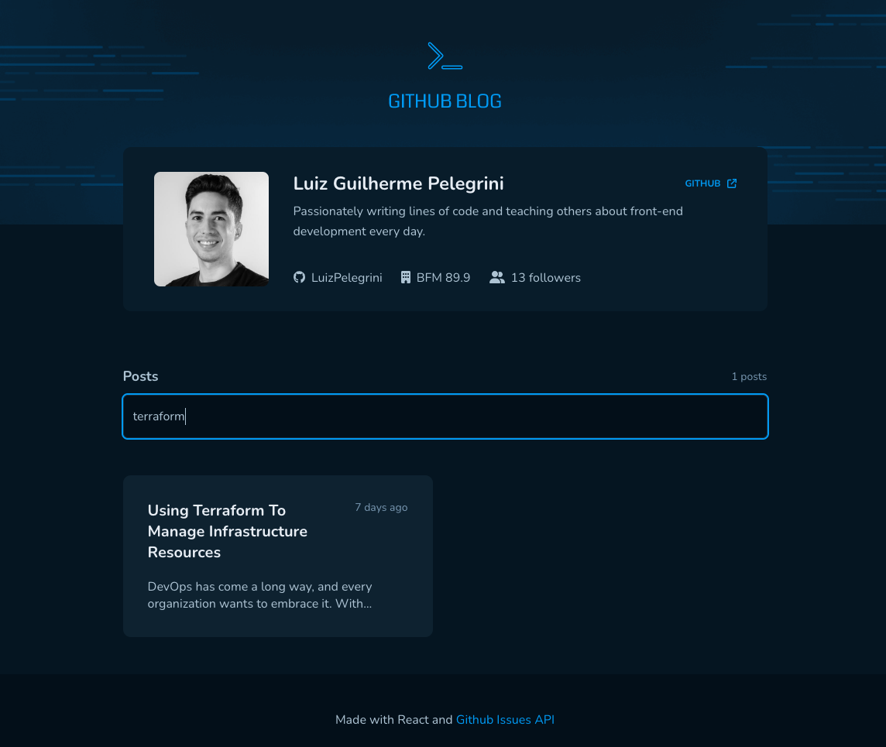
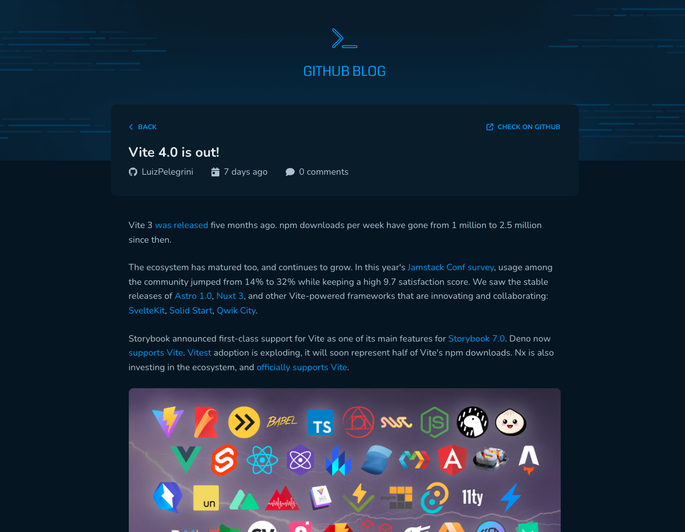

<h1 align="center">Github Blog</h1>

  

## About
React app that simulates a blog website. All posts come from Issues created in this same repository. The app fetches the posts by using the <a href="https://docs.github.com/en/rest/issues/issues?apiVersion=2022-11-28" target="_blank">Github API</a> and also filters them given the query entered by the user.

## ✨ Live project
<a href="https://luizpelegrini.github.io/github-blog/" target="_blank">https://luizpelegrini.github.io/github-blog</a>

 

### 🧑‍💻 What I learn
* For better UX, display html skeleton while data is being fetched.
* React Router DOM hooks to extract url information.
* Data fetching using `axios`.
* Render markdown text on the page using `react-markdown`.
* Apply responsiveness by adding media queries to `styled-components`.

 

---

 

  

    

    

 

---

 

## 🚀 How to run:

- Clone this repository.
- Run `npm install`.
- Run `npm run dev` to start the local server.
